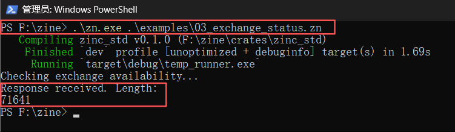
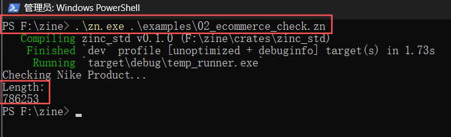
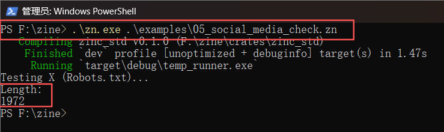

# Zinc Language
Smooth as Python, Stronger than Steel.

##  Performance Showcase

### 1. The Stealth Technology (JA3 Spoofing)
Zinc automatically spoofs TLS fingerprints to look exactly like Chrome 124.


*Evidence: Real `ja3_hash` and `h2` protocol negotiation.*

---

### 2. Battle Tested against Top WAFs
We tested Zinc against the world's hardest anti-bot systems.

| **Crypto Exchange (Cloudflare)** | **Top Fashion (Akamai)** |
| :--- | :--- |
| **Target:** Okx.com<br>**Status:**  Bypassed (70KB+) | **Target:** Nike.com<br>**Status:**  Product Data (780KB+) |
|  |  |

| **Cross-Border E-com** | **Social Media Edge** |
| :--- | :--- |
| **Target:** Shein (US)<br>**Status:**  Full Page (1MB+) | **Target:** X.com (Twitter)<br>**Status:**  Connected (Robots.txt) |
|  |  |

> *Disclaimer: These tests are for connectivity research purposes only.*

## Features
*   **Native Speed:** Compiles to Rust binary.
*   **JA3 Emulation:** Built-in anti-bot compatibility (`spider.get`).
*   **Zero-Copy:** Python bridge (Coming Soon).

## Usage Guide (Quick Start)

Hello World:
```zn
fn main() { print("Hello, Zinc!"); }
```

Spider:
```zn
fn main() {
    print("Testing connectivity...");
    let html = spider.get("https://example.com/", "chrome");
    print("Length: ");
    print(html.len());
}
```

## Installation Guide
1. Download `zn.exe` from the GitHub Releases page.
2. Install the Microsoft Visual C++ Redistributable if you do not have it.
3. Run `zn` directly. No other dependencies required.

##  License & Commercial Use
**Zinc is Dual-Licensed:**

1.  **Community Edition (AGPL v3):** Free for Open Source, Individuals, and Startups (<$1M Revenue).
2.  **Commercial Edition:** Paid license for larger companies & public corps. Exempts you from AGPL obligations.

See [COMMERCIAL_TERMS.md](COMMERCIAL_TERMS.md) for full details.
